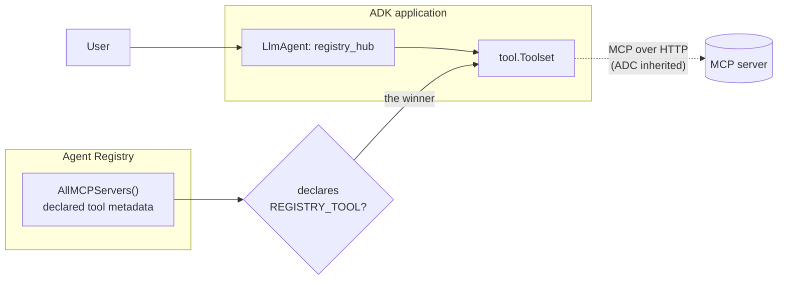

# Binding an agent to a capability

Build a running `LlmAgent` without knowing a single endpoint. You name the **tool you need**; the registry decides which MCP server provides it, and the sample binds that server at startup.

- **Concept:** search the catalog's tool metadata, then `Client.MCPToolset` the winner.
- **Needs LLM?** Yes
- **Needs a registry?** Yes — see [Prerequisites](../README.md#prerequisites).

## Goal

Show the registry doing something a config file cannot. Binding by resource name would be a wash — `MCPToolset(ctx, "projects/.../mcpServers/xyz")` is no better than pasting the endpoint URL into `mcptoolset.New`. Binding by **capability** is different: the answer depends on what is registered in this project right now, and it is computed from catalog metadata without connecting to a single candidate.

Two facts about real catalogs fall out of that, and the sample handles both:

- **A capability may have no provider.** Then there is nothing to bind and the sample says so.
- **A capability may have several.** Tool names are not unique across servers — in a stock project both `run.googleapis.com` and `agentregistry.googleapis.com` declare `list_services`, meaning entirely different things. The sample takes the first and names the others rather than guessing silently. Choosing between them is policy (a trusted publisher, an allowlist), so it belongs in your application, not here — and a generic tool name is the real smell.

Egress auth stays free along the way: an MCP server on `*.googleapis.com` inherits the credentials the registry client already holds, so nothing in this sample builds an OAuth client.

## Workflow



1. Scan the catalog for every server whose declared `Tools` include the wanted name.
2. Take the first, logging any others so a surprising pick is visible.
3. `MCPToolset` the winner, hand it to `llmagent.New`, serve through the launcher.

The live tool set comes from the MCP server itself once connected — the catalog metadata is only used to *choose*.

## Running the sample

```bash
export GOOGLE_CLOUD_PROJECT=your-project
export GOOGLE_CLOUD_LOCATION=global

# Model credentials: a Gemini API key...
export GOOGLE_API_KEY=...
# ...or Vertex AI (GOOGLE_CLOUD_PROJECT/LOCATION are already set above)
export GOOGLE_GENAI_USE_VERTEXAI=true

go run ./examples/agentregistry/bind/ console
```

No resource names to paste: the default capability is `deploy_service_from_image`, which any project with the Cloud Run API enabled already provides.

| Variable | Required | Meaning |
|---|---|---|
| `GOOGLE_CLOUD_PROJECT` | yes | Project whose registry is searched |
| `GOOGLE_CLOUD_LOCATION` | no | Registry location, defaults to `global` |
| `REGISTRY_TOOL` | no | Capability to look for, defaults to `deploy_service_from_image` |

The launcher also serves `restapi`, `a2a`, and `webui`; run with `help` to see the options.

## Example session

Real output. The default capability resolves to one provider, and the tools it brings are then callable:

```text
$ go run ./examples/agentregistry/bind/ console
Tool "deploy_service_from_image" is provided by "run.googleapis.com" (projects/my-project/locations/global/mcpServers/agentregistry-00000000-0000-0000-76f4-702f82fb93ff)

User -> List the Cloud Run services in project my-project, region us-central1. Say which tool you used.
Agent -> I used the **`list_services`** tool.

         There are no Cloud Run services found in project `my-project` for region
         `us-central1`.
```

Asking for a deploy capability and then listing services is the point: you bind a *provider*, and get everything it serves. `list_services` was never named in the code or the environment.

Ask for a generic capability and the ambiguity is reported rather than hidden:

```text
$ REGISTRY_TOOL=list_services go run ./examples/agentregistry/bind/ console
"list_services" is also declared by run.googleapis.com
Tool "list_services" is provided by "agentregistry.googleapis.com" (projects/my-project/locations/global/mcpServers/agentregistry-00000000-0000-0000-7ea4-5846298719d4)
```

Ask for one nobody provides, and you find out before an agent exists:

```text
$ REGISTRY_TOOL=send_carrier_pigeon go run ./examples/agentregistry/bind/ console
Failed to find a provider for "send_carrier_pigeon": no registered MCP server
declares it; run the discover sample to see what is available
```

At no point does the sample contain an endpoint URL, a tool schema, or a token.

## Notes

- **Declared tools are metadata, not a contract.** `MCPServer.Tools` is what was uploaded with the server spec, so it can lag the server. It is the right input for *choosing* a server and the wrong one for *calling* it — the agent only ever calls what the live MCP connection reports.
- **The scan reads the whole catalog.** `AllMCPServers` pages on demand, and the sample drains it so it can report every provider rather than the first one it trips over. Narrow it with `WithFilter` if your catalog is large enough for that to matter.
- **Don't set `http.Client.Timeout` on an egress client.** It is a deadline over the whole request and would truncate a streaming response; bound the `Transport` instead.
- **Resolution happens once, at startup.** A provider that changes in the registry is picked up on the next run, not mid-session.
- **A2A agents work the same way** via `Client.RemoteAgent`, but their egress is never authenticated for you — see [the index](../README.md#core-concepts-at-a-glance).
