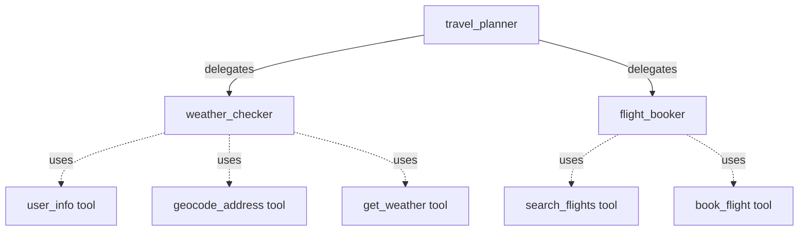

# ADK Collaborative Agent Team Sample

## Overview

It shows a small **collaborative agent team** where a root chat-mode
coordinator delegates work to two specialist sub-agents — one in
`single_turn` mode and one in `task` mode — and they each return control
automatically when done.

The three modes work together:

| Sub-agent         | Mode          | User interaction              | Return to parent        |
|-------------------|---------------|-------------------------------|-------------------------|
| `travel_planner`  | `chat` (root) | Full chat with the user       | n/a (root)              |
| `weather_checker` | `single_turn` | None                          | Automatic, with result  |
| `flight_booker`   | `task`        | Clarifying questions allowed  | Automatic, with result  |

For mode semantics see [Build collaborative agent teams](https://adk.dev/workflows/collaboration/).

## Sample Inputs

- `What's the weather like at home today?`
- `Is it raining in Tokyo?`
- `Please book me a flight from Zurich to London on 2026-07-12. I'm Alex Müller, window seat.`
- `Book a flight Zurich → Barcelona on 2026-08-01.` _(the task agent will ask for the missing passenger name)_

## Graph



## How To

1. Build a `single_turn` sub-agent for autonomous lookups:

   ```go
   weatherChecker, err := llmagent.New(llmagent.Config{
       Name:  "weather_checker",
       Model: model,
       Mode:  llmagent.ModeSingleTurn,
       Tools: []tool.Tool{getWeatherTool, userInfoTool, geocodeAddressTool},
       // ...
   })
   ```

1. Build a `task` sub-agent for structured, possibly multi-turn data work:

   ```go
   flightBooker, err := llmagent.New(llmagent.Config{
       Name:         "flight_booker",
       Model:        model,
       Mode:         llmagent.ModeTask,
       InputSchema:  flightInputSchema,
       OutputSchema: flightResultSchema,
       Tools:        []tool.Tool{searchFlightsTool, bookFlightTool},
       // ...
   })
   ```

1. Assign both to a coordinator (chat is the default mode for a sub-agent):

   ```go
   travelPlanner, err := llmagent.New(llmagent.Config{
       Name:      "travel_planner",
       Model:     model,
       SubAgents: []agent.Agent{weatherChecker, flightBooker},
       // ...
   })
   ```

The coordinator delegates by mentioning the sub-agent's name in its
instruction. ADK auto-injects the matching delegation tool for each
sub-agent. A `single_turn` or `task` sub-agent returns control to the
coordinator automatically once it produces its result; no explicit
`transfer_to_agent` call is required (this contrasts with default `chat`
mode, which requires a manual handoff).

## Run

Set your API key and run the sample with the console launcher:

```sh
export GOOGLE_API_KEY=...
go run ./examples/multiagent/collaboration console
```

You can also serve it over REST or the web UI; run with `help` for all
launcher subcommands:

```sh
go run ./examples/multiagent/collaboration help
```

## See also

- [`examples/multiagent/single_turn`](../single_turn) — a single_turn
  sub-agent in isolation.
- [`examples/multiagent/task_sub_agent`](../task_sub_agent) — two task
  sub-agents in isolation.
