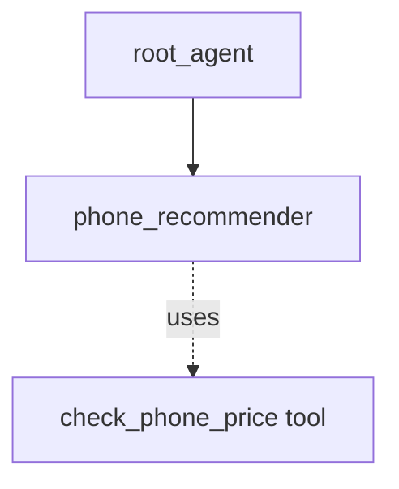

# ADK Single-turn Agent as Sub-agent Sample

## Overview

This sample demonstrates how a "single_turn" mode agent can act as an autonomous sub-agent to an LLM agent, utilizing schemas and tools without ever interacting with the user.

**Note**: This is the recommended mechanism to replace the older `AgentTool` pattern. Unlike `AgentTool`, using a `single_turn` sub-agent preserves the sub-agent's internal interactions (like tool calls) in the session history.

Single-turn agents are designed to execute their function fully in one prompt-response cycle. In this sample:

1. `phone_recommender`: A single-turn agent that receives structured input (`UserPreferences`), uses a mocked tool (`check_phone_price`), and returns structured output (`PhoneRecommendation`).
1. `root_agent`: The main agent that interacts with the user, translates their natural language request into the structured `UserPreferences`, and delegates to `phone_recommender`.

## Sample Inputs

- `I need a phone mostly for gaming. I have about $1000 to spend.`

- `What is a good cheap phone from Google for basic tasks?`

- `I love photography but prefer smaller phones. My budget is $600.`

## Graph



## How To

1. Define a sub-agent with `Mode: llmagent.ModeSingleTurn`, `InputSchema`, `OutputSchema`:

   ```go
   phoneRecommender, err := llmagent.New(llmagent.Config{
       Name:         "phone_recommender",
       Model:        model,
       Mode:         llmagent.ModeSingleTurn,
       InputSchema:  userPreferencesSchema,
       OutputSchema: phoneRecommendationSchema,
       Tools:        []tool.Tool{checkPhonePriceTool},
       // ...
   })
   ```

1. Assign it to a parent agent:

   ```go
   rootAgent, err := llmagent.New(llmagent.Config{
       SubAgents: []agent.Agent{phoneRecommender},
       // ...
   })
   ```

## Run

Set your API key and run the sample with the console launcher:

```sh
export GOOGLE_API_KEY=...
go run ./examples/multiagent/single_turn console
```
