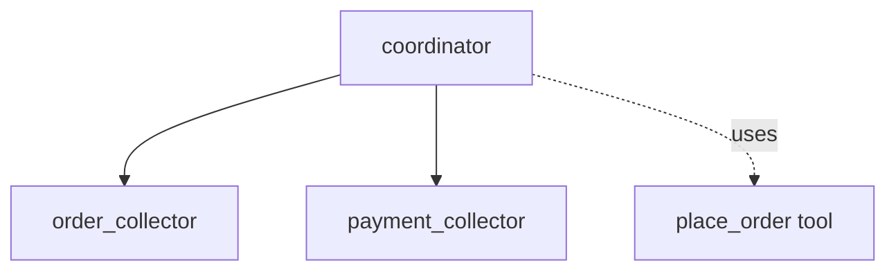

# ADK Task as Sub-agent Sample

## Overview

This sample demonstrates how a "task mode" agent can act as a sub-agent to an LLM agent, effectively extracting structured data from a conversational flow.

The main agent (`coordinator`) delegates interactions to two sub-agents:

1. `order_collector`: A task agent that collects the user's food order (from a menu of Pizza, Burger, Salad) and returns a structured list of selected items as a `[]OrderItem`.
1. `payment_collector`: A task agent that collects the user's credit card and CVV information, returning a `PaymentInfo` object.

Once the tasks are completed, the coordinator automatically uses a `place_order` tool with the structured data returned by both agents.

## Sample Inputs

- `I would like to order some food please.`

- `I want 2 pizzas and 1 salad.`

- `My credit card is 1234-5678-9012-3456 and my CVV is 123.`

## Graph



## How To

1. Define a sub-agent with `Mode: llmagent.ModeTask` and an output schema:

   ```go
   orderCollector, err := llmagent.New(llmagent.Config{
       Name:         "order_collector",
       Model:        model,
       Mode:         llmagent.ModeTask,
       OutputSchema: orderListSchema,
       // ...
   })
   ```

1. Assign it to a parent agent and use it in the instruction to collect the information:

   ```go
   coordinator, err := llmagent.New(llmagent.Config{
       SubAgents:   []agent.Agent{orderCollector},
       Instruction: "Delegate using `order_collector`...",
       // ...
   })
   ```

## Run

Set your API key and run the sample with the console launcher:

```sh
export GOOGLE_API_KEY=...
go run ./examples/multiagent/task_sub_agent console
```
