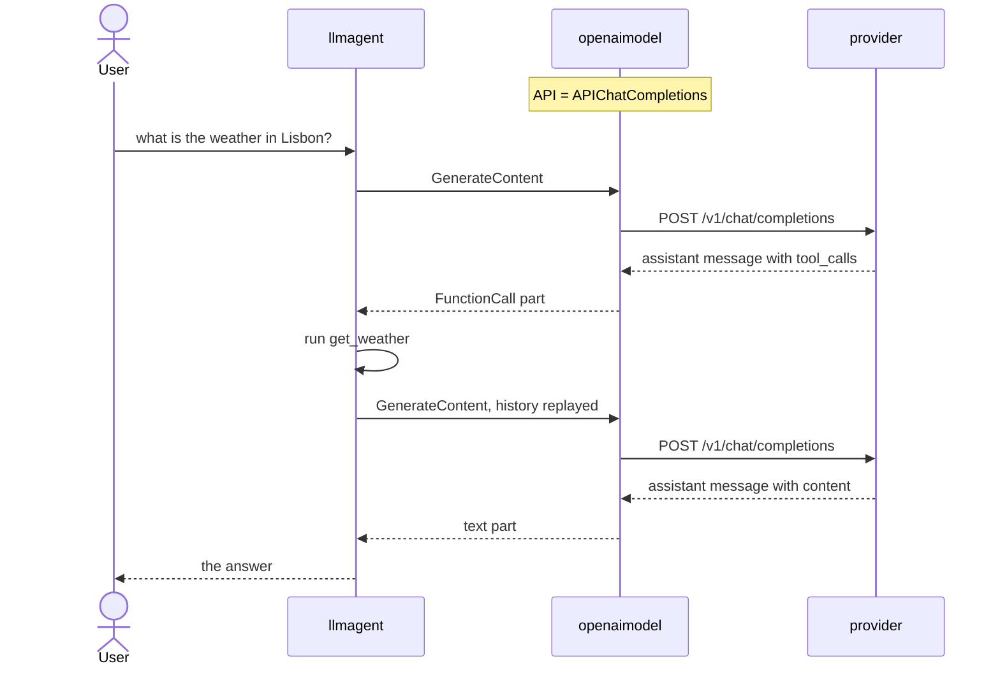

# OpenAI Chat Completions

Runs an ordinary ADK `llmagent`, with a tool, over OpenAI's **Chat Completions**
API. That is the surface most OpenAI-compatible providers implement, so the same
program reaches DeepSeek, Groq, Together, Fireworks, Mistral, OpenRouter and
Ollama by changing two environment variables.

- **Concept:** `ClientConfig.API = openaimodel.APIChatCompletions` picks the endpoint; everything downstream is unchanged.
- **Needs LLM?** Yes (OpenAI, or any provider speaking Chat Completions)

## Goal

Show that reaching a non-OpenAI provider is a configuration change, not a code
change. The sibling [responses](../responses) sample is the same agent on
OpenAI's newer API; the only difference between the two programs is one field:

```go
m, err := openaimodel.NewModel(ctx, modelName, &openaimodel.ClientConfig{
    APIKey:  apiKey,
    BaseURL: baseURL,
    API:     openaimodel.APIChatCompletions,
})
```

Leave that field out and the package posts to `/v1/responses`, which a
Chat-Completions-only provider does not serve.

## Configuration

| Variable | Required | Meaning |
| :---- | :---- | :---- |
| `OPENAI_API_KEY` | one of the two | Key for the provider. |
| `OPENAI_BASE_URL` | one of the two | Endpoint, for anything that is not `api.openai.com`. |
| `OPENAI_MODEL` | no | Model name. Defaults to `gpt-4o-mini`. |

## How it works



The second request is the interesting one. The tool call goes back as
`tool_calls` on an assistant message and its result as a separate `tool` message
keyed by `tool_call_id`, which is a different shape from how the Responses API
replays the same exchange.

## Running the sample

Against OpenAI:

```bash
export OPENAI_API_KEY=sk-...
go run ./examples/openai/completions
```

Against another provider, for example Groq:

```bash
export OPENAI_API_KEY="$GROQ_API_KEY"
export OPENAI_BASE_URL=https://api.groq.com/openai/v1
export OPENAI_MODEL=llama-3.3-70b-versatile
go run ./examples/openai/completions
```

## Example session

Real output, from `gpt-4o-mini` against `api.openai.com`. The model's wording
varies between runs; the temperature does not, because `get_weather` returns a
fixed value.

```text
User -> What is the weather in Lisbon?
Agent -> The weather in Lisbon is currently 22°C and sunny.
```

## Notes

Three generation-config fields work here and are rejected on the Responses path,
because only this endpoint has them: `StopSequences`, `FrequencyPenalty` with
`PresencePenalty`, and `Seed`. Support is per model rather than per endpoint —
the GPT-5 class reasoning models reject all three with a 400 naming the field,
while `gpt-4o-mini` accepts them.

`ThinkingConfig.IncludeThoughts` is accepted and ignored. Chat Completions has
no reasoning summary to ask for, so a config that works against Responses is not
refused here, it simply produces no thought parts.
