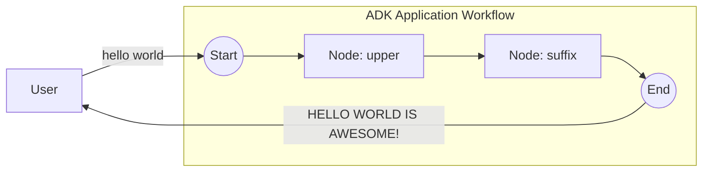

# Basic sequential workflow

The smallest possible workflow: two `FunctionNode`s wired into a straight chain with `workflow.Chain`. The first node uppercases the user's message, the second appends a suffix. No LLM, no routing, no HITL — just the sequential happy path.

- **Concept:** Chain nodes in order with `workflow.Chain(Start, nodeA, nodeB)`.
- **Needs LLM?** No

## Goal

Show the absolute minimum needed to stand up a workflow agent: define plain Go functions, wrap each as a `FunctionNode`, connect them with `Chain`, and hand the result to the launcher. Each node's output becomes the next node's input.

## Workflow



1. **upper**: a `FunctionNode` that receives the user message and returns `strings.ToUpper(input)`.
2. **suffix**: a `FunctionNode` that appends `" IS AWESOME!"` to its input.

Only the final node's output is surfaced to the user; the intermediate `HELLO WORLD` flows on as `suffix`'s input but is not printed on its own. Both nodes use `workflow.DefaultRetryConfig()` so a transient failure is retried with backoff.

## Running the sample

```bash
go run ./examples/workflow/basic/ console
```

## Example session

```text
User -> hello world
Agent -> HELLO WORLD IS AWESOME!
```
