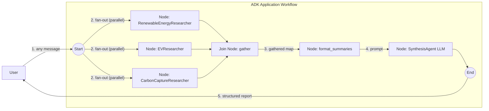

# Complex workflow — parallel research → join → synthesize

A non-trivial graph that fans out to three researchers, gathers their results at a barrier, and merges them with a final agent. It is the graph-native version of the adk-python "parallel web research" sample, and the showcase for the graph workflow engine's fan-out / fan-in.

- **Concept:** Fan-out to concurrent agents, fan-in at a `JoinNode`, then synthesize (`AddFanOut` + `AddFanIn` + `NewJoinNode`).
- **Needs LLM?** Yes (Gemini with Google Search grounding)

## Goal

Demonstrate the engine's parallel-branch primitives end to end: three researcher agents run concurrently on independent topics, a join barrier waits for all of them, a function node reshapes the gathered results into one prompt, and a single-turn synthesis agent merges everything into one structured report.

## Authentication

The researchers call Gemini with Google Search grounding, so an API key is required:

```bash
export GOOGLE_API_KEY=...
```

## Workflow



`Start` fans out to three researchers that run concurrently; the `gather` join node is the barrier that waits for all three and hands its successor a `map[nodeName]output`; `format_summaries` turns that map into one prompt; and the `SynthesisAgent` merges everything into the final report.

## Running the sample

```bash
export GOOGLE_API_KEY=...
go run ./examples/workflow/complex/ console
```

Send any message to start a run — the research topics are fixed, so the message just triggers the pipeline.

Every node emits events, so the console prints **all three researcher summaries first, then the synthesized report**. The summaries appear in nondeterministic order (the researchers run concurrently), and in an interactive terminal the default token streaming interleaves them. For clean, block-at-a-time output, disable streaming:

```bash
go run ./examples/workflow/complex/ console -streaming_mode none
```

## Example session

```text
Agent -> Driven by falling costs, solar PV is projected to overtake ...   (RenewableEnergyResearcher)
Agent -> The latest electric vehicle advancements focus on ...            (EVResearcher)
Agent -> Recent advancements in carbon capture feature ...                (CarbonCaptureResearcher)
Agent -> ## Recent Sustainable Technology Advancements                    (SynthesisAgent)

         ### Renewable Energy
         ...

         ### Electric Vehicles
         ...

         ### Carbon Capture
         ...

         ### Overall Conclusion
         ...
```

## What it shows

| Concept | Where |
|---|---|
| Fan-out — independent nodes run concurrently | `eb.AddFanOut(workflow.Start, renewableNode, evNode, carbonNode)` |
| Fan-in — a barrier that waits for every predecessor | `workflow.NewJoinNode("gather")` + `eb.AddFanIn(...)` |
| Consuming the join's `map[nodeName]output` | `formatSummaries` reads the gathered map by node name |
| A `FunctionNode` transforming data mid-graph | `format_summaries` turns the map into one prompt |
| A single-turn `AgentNode` after a predecessor (not `Start`) | the `SynthesisAgent` node consumes the formatter's output |
| Per-node retries with backoff | `llmNodeConfig.RetryConfig` on the LLM nodes |
| Built-in Google Search grounding | `geminitool.GoogleSearch{}` on each researcher |
| Default in-memory session | `launcher.Config` sets only `AgentLoader` |

## Notes

A `JoinNode` is the only node that may have several **unconditional** incoming edges; converging plain nodes that way is rejected (`ErrUnsupportedFanIn`). Wrapping an `LlmAgent` in an `AgentNode` defaults it to single-turn mode, which is what lets the synthesis agent sit mid-graph: a chat-mode agent may only be wired directly from `Start`.

This fan-out/gather behavior matches adk-python's graph workflow, which emits the same per-researcher events before the synthesis.
