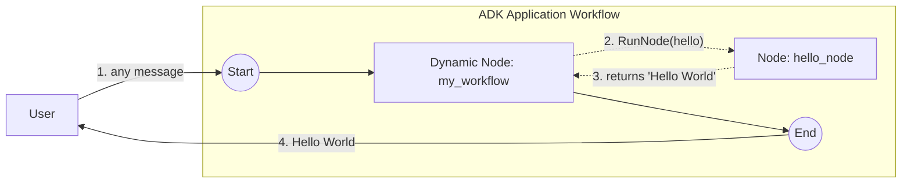

# Dynamic workflow (basic)

A minimal **dynamic** workflow: a parent dynamic node expresses execution order as ordinary Go code and invokes a single child node via `workflow.RunNode`. Mirrors the "Get started" snippet from <https://adk.dev/graphs/dynamic/>.

- **Concept:** Orchestrate children imperatively with `workflow.NewDynamicNode` + `workflow.RunNode`, instead of declaring static edges.
- **Needs LLM?** No

## Goal

Static graphs (see [`../../basic`](../../basic)) declare every edge up front. A **dynamic node** instead runs a Go function as its body and decides at runtime which child nodes to call, in what order — useful for loops, branching, and data-dependent control flow. This sample is the smallest version: the orchestrator calls one child and returns its output.

## Workflow



Solid arrows are static graph edges; dotted arrows are imperative `RunNode` calls made from inside the dynamic node's body. `hello_node` ignores its input and returns the constant `"Hello World"`. Dynamic nodes default to `RerunOnResume = &true`, which is required for the re-entry/resume model (see [`../hitl`](../hitl)).

## Running the sample

```bash
go run ./examples/workflow/dynamic/basic/ console
```

## Example session

The orchestrator ignores the message text, so any input triggers the same run.

```text
User -> hi
Agent -> Hello World
```
