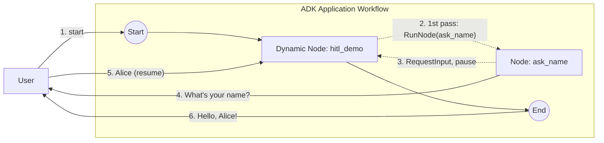

# Dynamic workflow + Human-in-the-Loop

A dynamic orchestrator that **pauses for human input** via `workflow.RunNode`, then resumes and greets the user. Demonstrates the dynamic re-entry resume pattern.

- **Concept:** Pause a dynamic node for input, then resume by re-running its body and reading the reply from `agent.Context.ResumedInput`.
- **Needs LLM?** No

For the static-chain version of the same scenario, see [`../../hitl_simple`](../../hitl_simple).

## Goal

Show how Human-in-the-Loop works inside a *dynamic* node. Dynamic nodes default to `RerunOnResume = &true`: after the human replies, the orchestrator body is re-invoked **from the top**, and the reply is delivered through `ResumedInput(interruptID)`. The body checks for that reply first; if it isn't there yet, it calls the `ask_name` node, which emits a `RequestInput` and interrupts the run.

## Workflow



- **First pass:** `hitl_demo` finds no resumed input, so it runs `ask_name`, which emits a `RequestInput` event (keyed by an invocation-derived `InterruptID`) and returns `ErrNodeInterrupted` — the run pauses.
- **Resume:** the console forwards the human's reply; `hitl_demo` re-runs from the top, finds the reply under the same `InterruptID` via `ResumedInput`, emits the greeting as content, and returns.

## Running the sample

```bash
go run ./examples/workflow/dynamic/hitl/ console
```

## Example session

```text
User -> start
Agent -> What's your name?
User -> Alice
Agent -> Hello, Alice!
```
