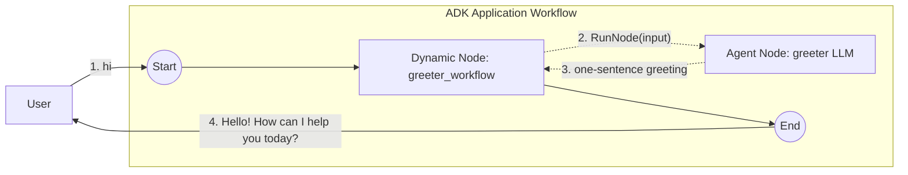

# Dynamic workflow + LLM

A dynamic orchestrator that invokes a single `LlmAgent`-backed node via `workflow.RunNode`. The smallest useful composition of `NewDynamicNode`, `NewAgentNode`, and `RunNode`.

- **Concept:** Call an `LlmAgent` from inside a dynamic node's Go body by wrapping it as an `AgentNode` and invoking it with `RunNode`.
- **Needs LLM?** Yes (Gemini)

## Goal

Bridge the two building blocks: an `LlmAgent` (the model) and a dynamic node (imperative control flow). The agent is wrapped with `workflow.NewAgentNode` so it can be driven from code, then the dynamic orchestrator calls it once and returns its reply. The same shape scales to multi-step pipelines, branching, and loops — just add more `RunNode` calls to the body.

## Authentication

The model client reads its config from the environment, so set one of:

```bash
# Option A — Gemini API key
export GOOGLE_API_KEY=...

# Option B — Vertex AI via gcloud Application Default Credentials
gcloud auth application-default login
export GOOGLE_GENAI_USE_VERTEXAI=true
export GOOGLE_CLOUD_PROJECT=your-project
export GOOGLE_CLOUD_LOCATION=your-region   # e.g. us-central1
```

## Workflow



Solid arrows are static graph edges; the dotted arrows are the imperative `RunNode` call into the wrapped `LlmAgent`. The `greeter` agent's only instruction is to greet the user in exactly one short sentence.

## Running the sample

```bash
go run ./examples/workflow/dynamic/llm/ console
```

## Example session

The exact wording comes from the model, so it varies between runs.

```text
User -> hi
Agent -> Hello there! How can I help you today?
```
