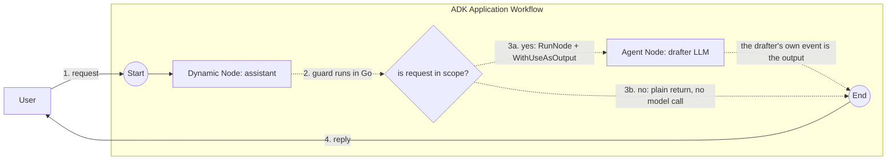

# Dynamic workflow + output delegation

A dynamic orchestrator that hands its terminal output to a child node instead
of producing one. An in-scope request is delegated to an `LlmAgent` child with
`workflow.WithUseAsOutput()`, so the agent's own event *is* the orchestrator's
output. An out-of-scope request is answered by the orchestrator itself with an
ordinary `return`.

- **Concept:** Promote a child's output to the parent dynamic node's terminal
  output with `workflow.RunNode(..., workflow.WithUseAsOutput())`.
- **Needs LLM?** Yes (Gemini), on the delegating branch only

## Goal

By default a dynamic node's output is whatever its Go body returns, so
delegating to a child means capturing the child's value and returning it again.
That works, but it emits the same content twice: once on the child's event and
once on the orchestrator's terminal event.

`WithUseAsOutput()` removes the second one. The child's event is stamped as the
parent's output and the parent emits no terminal event of its own, so an
`LlmAgent` child's reply reaches the caller exactly once, authored by the agent
rather than by the workflow.

The sample puts both behaviors in one node so the difference is visible from the
console: type a request mentioning an email to take the delegating branch, or
anything else to take the plain-return branch.

## Authentication

The model client reads its config from the environment, so set one of:

```bash
# Option A — Gemini API key
export GOOGLE_API_KEY=...

# Option B — Vertex AI via gcloud Application Default Credentials
gcloud auth application-default login
export GOOGLE_GENAI_USE_VERTEXAI=true
export GOOGLE_CLOUD_PROJECT=your-project
export GOOGLE_CLOUD_LOCATION=your-region   # e.g. us-central1
```

## Workflow



Solid arrows are static graph edges. Everything dotted happens inside the
orchestrator's Go body: the `isEmailRequest` guard, the imperative `RunNode`
call, and the output each branch produces. Exactly one of `3a` and `3b` runs per
turn.

## Running the sample

```bash
go run ./examples/workflow/dynamic/use_as_output/ console
```

## Example session

The email wording comes from the model, so it varies between runs. Which branch
runs does not — it is decided in Go.

```text
User -> what is the weather today
Agent -> Out of scope. Ask me to draft an email.

User -> email the team that Friday standup is cancelled
Agent -> Subject: Cancelled: Friday Standup
Hi Team,
Please note that our standup meeting scheduled for this Friday is cancelled. We will resume our regular standup schedule on Monday.
If you have any urgent updates or blockers before the weekend, please feel free to share them in our team chat.
Best regards,
[Your Name]
```

## What it shows

| Concept | Where |
|---|---|
| `workflow.WithUseAsOutput()` | passed to `RunNode` on the in-scope branch, promoting the drafter's output to `assistant`'s terminal output |
| Delegation suppresses the parent's terminal event | the drafter's reply is emitted once, authored by `drafter`, and `assistant` emits no event of its own |
| Plain return as output | the out-of-scope branch returns a string from the body, which becomes `assistant`'s terminal output |
| Registering a wrapped agent | `SubAgents: []agent.Agent{drafterAgent}` lets the runner resolve `drafter` as the event author |

## Notes

### Why the branch is decided in plain Go

The guard is a substring check on the user's request, not a model call or a
length check on generated text. That keeps both branches reachable on demand, so
the run above reproduces. A guard that depends on model output would make which
branch runs vary per run, which is the wrong property for a sample whose whole
point is the difference between the two branches.

### One delegation per activation

`WithUseAsOutput()` may be used on at most one child per parent activation. A
second delegating `RunNode` call in the same body fails with
`workflow.ErrOutputAlreadyDelegated`. Delegation also chains: if the delegated
child is itself a dynamic node that delegates, the innermost child's event is
stamped for the whole ancestor chain.

### Tunable: pick a different model

Edit `gemini-flash-latest` in `main.go` to whatever model your credentials have
access to. The drafter prompt is short and any modern Gemini model handles it.
