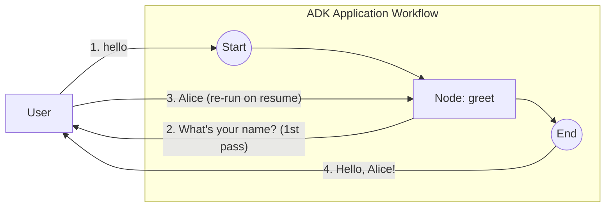

# Human-in-the-Loop (single-node re-entry)

A Human-in-the-Loop workflow where **one** emitting `FunctionNode` both pauses for input and produces the final output. On resume the node is re-run from scratch (`NodeConfig.RerunOnResume = &true`).

- **Concept:** Single-node re-entry HITL with `workflow.ResumeOrRequestInput`.
- **Needs LLM?** No

For the two-node handoff variant, see [`../hitl_simple`](../hitl_simple).

## Goal

Contrast two ways to do HITL. The two-node *handoff* variant ([`../hitl_simple`](../hitl_simple)) has one node ask and a separate node consume the reply. This sample collapses both phases into a single re-run node:

- `workflow.ResumeOrRequestInput` emits a `RequestInput` and returns `ErrNodeInterrupted` on the **first** pass (pause, no output);
- after the human replies, the node is **re-run from the top**, and the same call now returns the reply, which the body turns into the terminal output.

## Workflow



The numbered edges are the user ↔ application exchange, in order. Because `RerunOnResume = &true`, the reply at step 3 re-enters `greet` (instead of flowing on to a successor, as it would in [`../hitl_simple`](../hitl_simple)), so the same node executes twice: first it asks and pauses (step 2), then on resume it is re-run from the top and produces the greeting (step 4). The `InterruptID` embeds the invocation ID so the reply still correlates across the re-run within a single run, yet a later run re-prompts.

## Running the sample

```bash
go run ./examples/workflow/hitl_rerun/ console
```

## Example session

```text
User -> hello
Agent -> What's your name?
User -> Alice
Agent -> Hello, Alice!
```
