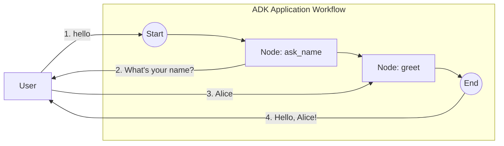

# Human-in-the-Loop (minimal, two nodes)

The minimal end-to-end HITL workflow: two nodes where the first pauses for input and the second consumes the human's reply. No LLM, no API key, no streaming — the smallest thing that exercises the console launcher's pause/resume support.

- **Concept:** Two-node HITL handoff — pause with `RequestInput`, resume into the next node.
- **Needs LLM?** No

Related variant: [`../hitl_rerun`](../hitl_rerun) — the same scenario as a single re-entry node.

## Goal

Demonstrate the simplest possible Human-in-the-Loop pattern. `ask_name` emits a `RequestInput` event and returns `ErrNodeInterrupted`, which pauses the workflow; the console launcher renders the prompt; the user's reply is delivered to `greet` as its typed input.

## Workflow



1. **ask_name**: an emitting `FunctionNode` that yields a `RequestInput` (with a fresh per-request `InterruptID`) and interrupts the run.
2. **greet**: an ordinary `FunctionNode` that receives the reply string and returns the greeting.

## Running the sample

```bash
go run ./examples/workflow/hitl_simple/ console
```

## Example session

```text
User -> hello
Agent -> What's your name?
User -> Alice
Agent -> Hello, Alice!
```
