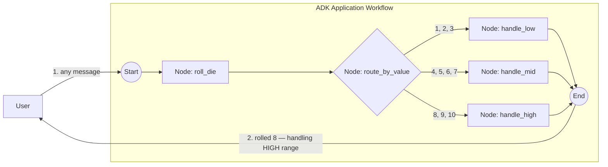

# Routing sample — random number → 3 branches

The smallest end-to-end demonstration of `workflow.IntRoute` / `workflow.MultiRoute` and the `Event.Routes` contract. No LLM, no HITL, no persistence — just routing.

- **Concept:** Numeric routing with `IntRoute` / `MultiRoute[int]` over an `Event.Routes` value.
- **Needs LLM?** No

## Goal

Roll a random integer 1..10 and dispatch to one of three handlers based on which range it falls in. Shows how a node sets `Event.Routes` (and `Event.Output`) so the engine selects the matching downstream edge.

## Workflow



`roll_die` returns an `int`; `route_by_value` emits an event whose `Routes` is the stringified value and whose `Output` is the value itself, so the matched handler receives a typed `int`. Each `MultiRoute[int]` edge matches a set of values (the LOW / MID / HIGH ranges).

## Running the sample

```bash
go run ./examples/workflow/routing/int/ console
```

## Example session

Type any message; the sample ignores it and rolls a fresh number each turn, so the branch changes from run to run (LOW = 1..3, MID = 4..7, HIGH = 8..10):

```text
User -> hi
Agent -> rolled 8 — handling HIGH range (8..10)
```

## What it shows

| Concept | Where |
|---|---|
| `FunctionNode` producing a typed value | `roll_die` returns `int` |
| Custom `BaseNode` emitting a routing event | `route_by_value` sets `Event.Routes = []string{fmt.Sprint(value)}` and `Event.Output = value` so downstream FunctionNodes get a typed `int` input |
| `MultiRoute[int]` matching a set of ints | three downstream edges, one per range |
| Random behaviour to exercise different paths between runs | `math/rand/v2` in `roll_die` |

## Notes

In adk-go, `FunctionNode` cannot emit `Event.Routes`: its wrapper always builds a single output event from the return value, so the routing node drops down to a custom `BaseNode`. (adk-python has no such split — a plain function node there can `yield Event(route=...)` directly.)
