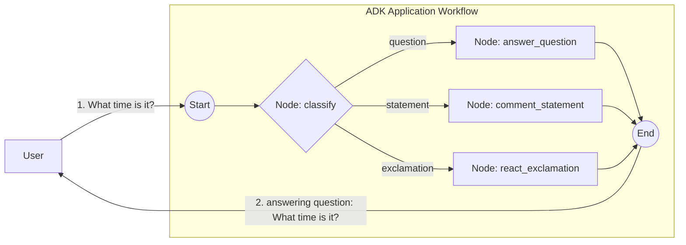

# String routing sample — message classification → 3 branches

The smallest end-to-end demonstration of `workflow.StringRoute` and the `Event.Routes` contract. No LLM, no HITL, no random — a trivial classifier picks the route based on the message's terminal punctuation.

- **Concept:** String routing with `StringRoute` over an `Event.Routes` value.
- **Needs LLM?** No

For the version where an LLM does the classification, see [`../llm`](../llm).

## Goal

Classify a message by its terminal punctuation (`?` / `!` / otherwise) and dispatch to one of three handlers. The single `classify` node emits both the route and the original message as output, so each handler receives the message as a typed `string`.

## Workflow



## Running the sample

```bash
go run ./examples/workflow/routing/string/ console
```

## Example session

The route is chosen by the message's terminal punctuation, so it is fully deterministic:

```text
User -> What time is it?
Agent -> answering question: What time is it?

User -> The sky is blue.
Agent -> commenting on statement: The sky is blue.

User -> Hello world!
Agent -> reacting to exclamation: Hello world!
```

## What it shows

| Concept | Where |
|---|---|
| Custom `BaseNode` emitting a routing event | `classify` sets `Event.Routes = []string{category}` and `Event.Output = msg` so downstream `FunctionNode`s get the original message as a typed `string` input |
| `StringRoute` matching a single value | three downstream edges, one per category |
| Direct port of adk-python's `route/` sample, minus the LLM | classifier is a plain Go function instead of an `Agent` with `output_schema` |
